# Lab 1 - Bluemix and Watson Conversation
In this first lab, we will complete some steps to prepare us for using Watson Conversation services.  By the end of this lab you will have completed the following:

* [Create a Bluemix account](https://github.com/ov3rblik/cerebro/tree/master/Lab1#creating-a-bluemix-account)
* [Add Watson Conversation Services to your Bluemix Account](https://github.com/ov3rblik/cerebro/tree/master/Lab1#add-watson-conversation-services-to-your-bluemix-account)
* [Import the Watson Conversation Services Workspace](https://github.com/ov3rblik/cerebro/tree/master/Lab1#import-the-watson-conversation-services-workspace)


## Creating a Bluemix Account
You will need a Bluemix account with at least 1 service slot free (for Watson Conversation Services, which will be added in the next section). 
````
If you already have a Bluemix Account then you may skip this section.
````


1. Navigate to http://bluemix.net in your browser.

2. From the landing page choose Create a Free Account.  On the next screen that appears, enter your email address (use your IBM email address if you are an IBM employee)
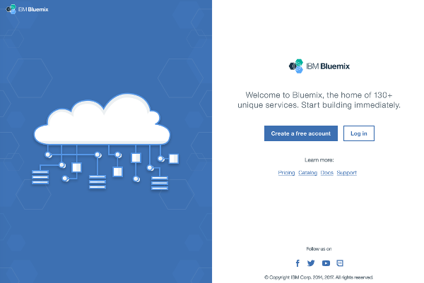

3. You will be asked to enter your IBM ID, enter it and press the Continue button.
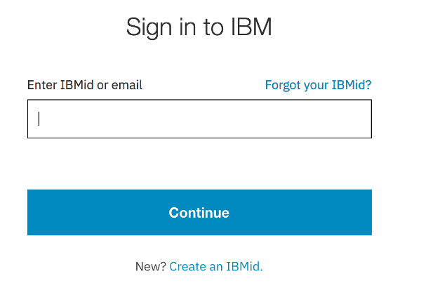

4. If you are asked to sign in with your W3ID then press the button to do so, otherwise go on to the next step.
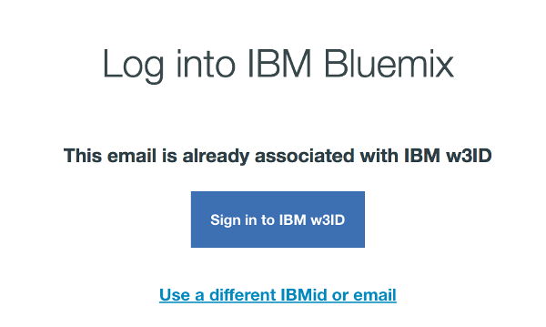

5. You should now be logged in, and at your Bluemix Dashboard which will look similar to this (but without the services added, we will do that next).
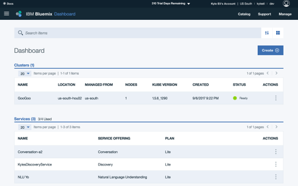

6. Now move on to the next section to add Watson Conversation Services to your Bluemix Account.

## Add Watson Conversation Services to your Bluemix Account
We will want the Slack bot to be able to respond to our users.  To do this we will need a conversation workspace and a dialog flow created using Watson Conversation Services.  Follow these steps to add the service to your Bluemix account.

````
If you already have Watson Conversation Services added to your Bluemix account then you can 
move on to the next section
````

1. Log in to your Bluemix Account.  You may already be logged in if you are here from the previous step - Creating a Bluemix Account.

2. From the Bluemix Dashboard, click on the Create button at the top right.

3. The next page is the Services Catalog.  From here you can add services to your Bluemix account.  Click on Watson in the bottom left pane of the page.
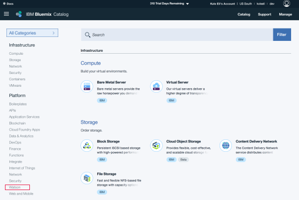

4. When the list of Watson services loads, choose Conversation by clicking on it
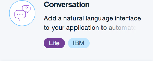

5. Give your service and credentials a name (or accept the defaults) and press Create at the bottom right.
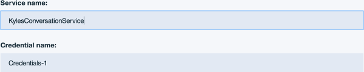

6. You should now see the Conversation landing page as shown below.
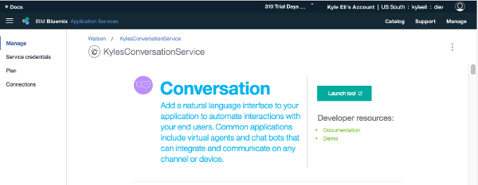

7. On the left hand pane, click the link which says `Service Credentials`, then under Actions click `View Credentials`.  Your `username` and `password` will be shown to you, copy and paste these to a safe location, we will need them later when connecting our code to WCS.
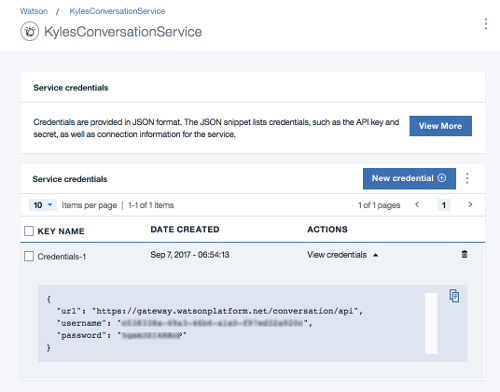

## Import the Watson Conversation Services Workspace
A Watson Conversation workspace has been provided for you in this lab folder.  You should download the file to your local hard drive and then follow these instructions to import the workpace to your Bluemix account:

1. First, download the `workspace.json` file in this Lab1 folder to your local hard drive.

2. Next log into your Bluemix account.

3. From the Bluemix Dashboard, locate your Conversation service and click on it to access the landing page.
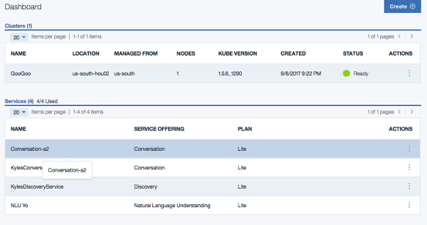

4. From the landing page, click the `Launch Tool` button.

5. When your Conversation Workspaces page opens, click on the upload icon next to the Create button
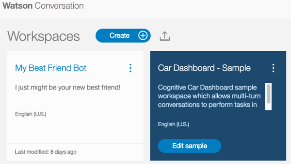

6. When the `Import a Workspace` dialog appears, press the `Choose a file` button and navigate to the workspace file you saved from this lab on your hard drive, and select OK/Open to add the filepath to the `Import a Workspace` dialog as shown in the image below.  Leave the `Import` radio button alone, and press the `Import` button at the bottom of the dialog.
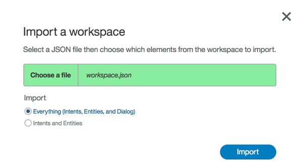

7. Your screen should now have the Conversation tooling page open as shown below.  We dont need to do anything further here, so we can exit this page (see step 8).
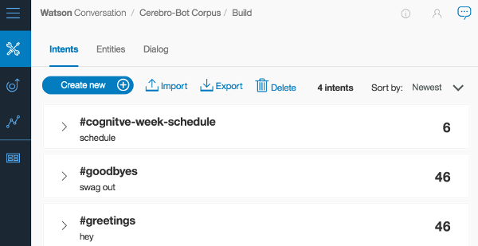

8. Find and click on this icon in the bottom of the icon tray on the left hand side of the page.  This icon takes you back to your Watson Conversation workspaces.


9. Now we need to collect the `Workspace ID` of our workspace so that we can add it to our code later.  To do this, find the tile for the Cerebro workspace we just uploaded, and then click on the 3 stacked dots at the upper right of the tile.  The tile will flip to show you some details, including the `workspace id`.  Copy and paste your ID to a safe place, we will use it later!

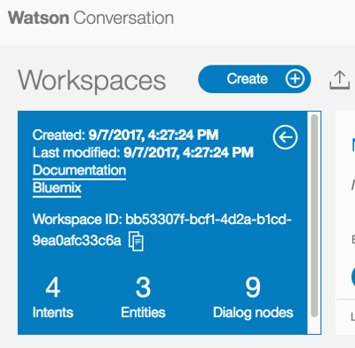


### I'm done, take me to [Lab 2](https://github.com/ov3rblik/cerebro/tree/master/Lab2)!
