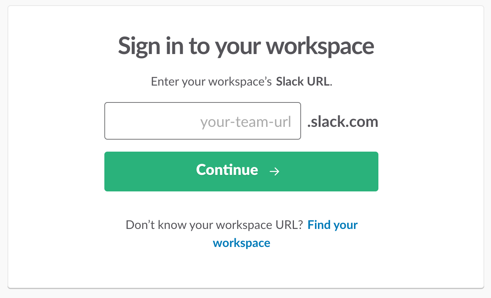
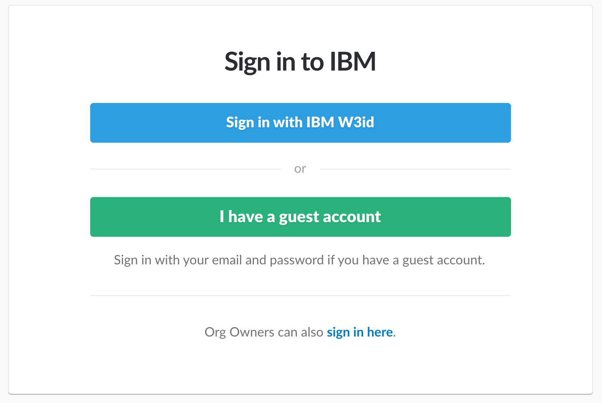
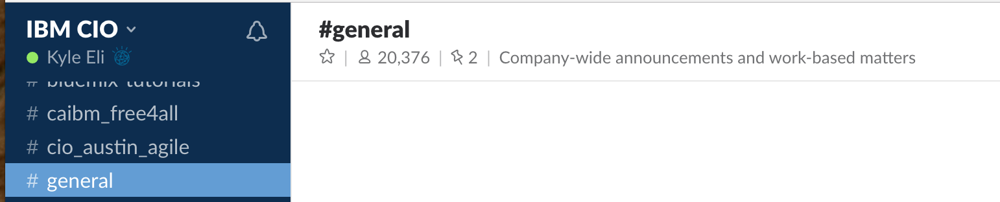
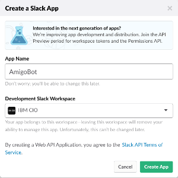

# Slack bot for IBM Slack channel

## Slack Account
````
If you already have a slack account, then you can skip this section.
````

1. Go to the following link http://slack.com/signin

2. You will see a sign-in page similar to the following.  If you are IBM CIO, then enter ````ibm-cio```` in the box which says `your-team-url'.  Otherwise add your team identifier or create your own team.  Finding your team identifier or creating your own slack team are out of scope for this lab.  *If you are not IBM, then once you are logged into Slack you are done and can advance to the next section*.


3. Next you will be asked to sign in with your W3 ID, click the W3ID button.  Enter your credentials when prompted and log in.


4. You should be presented with the #general channel (or whichever channel is the default for your team).  Great, you're done!



## Create and activate a Slack Bot
For this project we will be using Slack as the user interface to our Watson Conversation services chatbot.  In order to use Slack as the interface we will need to create a `bot-user` in Slack.  Follow these steps to create a `bot-user`

1. First you'll want to navigate to http://api.slack.com/apps

2. Click on the Create New App button


3. Give your bot a name, choose a team space, then press Create App



4. You will now see the Features and Functionality page of your bot you are creating.  Click on Bots, then click on Add a Bot User.

5. Give your bot an @name (you can accept the default).  Leave 'Always show my bot as online' set to `off`.  Click Add Bot User.

6. On the left hand side of the page you should see a list of links under **Settings**.  Select `Basic Information`.

7. Click on the words `Install your app to your workspace` to expand that section of the `Basic Information` page, then click on `Request Approval`.

8. An approval message will be sent to the Slack admin team to approve it so you can begin using it.  You will need to wait for them to approve your bot.  If you would like for them to approve your bot more quickly, then you can go to the Slack channel `#admin-requests` and follow their posting guidelines to request that someone approve your bot.  Courtesy and politeness go a long way, so be patient and kind to our Slack admins!

9. Once your bot is approved by the admin team you are ready to proceed with the lab!  If you're planning to use the texting/sms or Event Central functions of this lab, then you'll want to also complete those sections.


