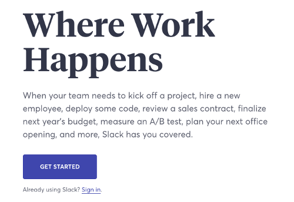

# Lab 2 - Slack Configuration
In this lab you will complete the following:
* [Create a new Slack team](https://github.com/ov3rblik/cerebro/tree/master/Lab2#create-a-new-slack-team)
* [Create a bot user in your Slack team](https://github.com/ov3rblik/cerebro/tree/master/Lab2#create-a-bot-user-in-your-slack-team)
* [Add the bot user to a channel](https://github.com/ov3rblik/cerebro/tree/master/Lab2#add-the-bot-user-to-a-channel)

## Create a new Slack team
The first step is to create a new Slack team.

1. Navigate your browser to http://slack.com.  When the page loads, if you are already signed in to a team then sign out of your slack account and then navigate back to http://slack.com

2. Click on the `Get Started` button on the page  

3. Next, click on `Create a new workspace`  

3. You'll need to use a personal email address here, to create your Slack workspace  

4. A code will be sent to your inbox of the personal email address you entered.  Check it and enter the code in the boxes provided.  

5. Enter your name and username values in the spaces provided.  Be creative, it doesn't need to be your real name!  

6. Answer the questions about what the team will be used for and continue to the next screen.  

7. Give your group a name - be creative!  

8. Pick a URL for your slack workspace.  Be sure to write it down or save it so you can get back to it later!  

9. You will be presented with a box to review terms.  Review the terms until you are comfortable and press `I agree`.

10. Next you're prompted to invite others.  Enter some non-work emails to invite others, or leave them blank and select `Skip for Now`.

11. You should now be logged into your new Slack team.  Click `Skip the Tutorial` at the very bottom of the page.  Congratulations!  You have created your own Slack team!

## Create a bot user in your Slack team
Now that your Slack team has been created you can create a bot for your Slack team.  

1. Navigate your browswer to https://api.slack.com/apps/

2. Click the `Create new app` button at the top of the page

3. In the popup window, give your app a name and then select the workspace you created in the previous section  

4. In the Basic Information area, click on Webhooks, then click the slider to enable them

5. Next click on Interactive Messages and enable these as well.

6. Click on Bots and then click on `Add a bot user`.  Give your bot a name then click on `Save Changes`.  

7. Click on Basic Information and now you should see a green check next to Add Features and Functionality  

Your bot has now been created!  Let's add it to a channel!

## Add the bot user to a channel
Once your bot is created it's time to add it to a channel.

1. Next we want to install our bot to our workspace.  Click on `Install your app to your workspace` and then click on the button which appears with the same text.  

2. Select the channel that you want to install your bot into, here we selected `#general`.  Next click `Authorize`  

3. Now we can invite your bot to the channel.  Navigate to your `#general` channel in your slack team, and then a the very top next to the search bar click on the information 'i' to open up a new panel on the right of the screen.  

4. Click on `Invite more people` and then type in the name of your bot with an '@' at the beginning and click invite.  

Congratulations!  You have now added your bot to your channel!  The next lab will show you how to connect that bot to Watson Conversation.

NOTE: For future reference, if you want to create a bot in an IBM slack team, the steps are slightly different but the process can take a few hours to a few days which is why that process wasnt used in this lab.  To find out more about creating a bot in an IBM slack team, visit the [IBM_Slackbot_README.md](https://github.com/ov3rblik/cerebro/blob/master/Lab2/IBM_Slackbot_README.md) file in this lab folder.

### Hey that was easy, let's go to [Lab 3](https://github.com/ov3rblik/cerebro/tree/master/Lab3)!
