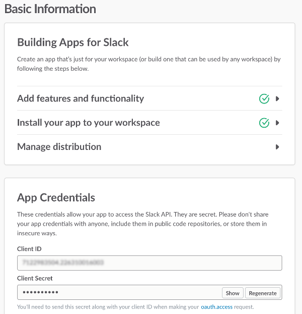

# Lab 3 - Connect Slack to WCS
Now it’s time to start building the code that will connect Slack to WCS.  This is done through javascript code which makes use of a node library built specifically for bots, called `Botkit`.

In this lab you will complete the following:

* [Clone the code repository from github](https://github.com/ov3rblik/cerebro/tree/master/Lab3#clone-the-code-repository-from-github)
* [Install dependencies from the repo](https://github.com/ov3rblik/cerebro/tree/master/Lab3#install-dependencies-from-the-repo)
* [Configure the .env file for your services](https://github.com/ov3rblik/cerebro/tree/master/Lab3#configure-the-env-file)
* [Configure Slack to use your WCS workspace](https://github.com/ov3rblik/cerebro/tree/master/Lab3#configure-slack-to-use-your-wcs-workspace)

## Clone the code repository from github
The very first step is to clone the github repository.  You can use the Clone/Download button on the repo page, or you can use this command line instruction from a terminal window:
````
$ git clone https://github.com/ov3rblik/cerebro
````

If you're unsure of how to clone the repo locally there are many instructions for this on the internet.

## Install dependencies from the repo
Here we need to install the javascript libraries that are required for this project. 

1. We will use `node package manager` or `npm` to install dependencies. Navigate your command line (command prompt on Windows, terminal window on Mac) to the root directory of the cloned github repo and type:
````
    npm install --save
````
2. The system will install the files for your and return you to the command prompt when it has finished.

## Configure the .env file
In the folder `<folder name>` there is a file titled `.env-sample`.  You'll want to update this file to inlcude the credentials needed to access your Watson Conversation workspace and the Slack bot you've created.

1. When you created your Watson Conversation service in the [Lab Setup Guide](https://github.com/ov3rblik/cerebro/tree/master/Lab_Setup#add-watson-conversation-services-to-your-bluemix-account), you saved your credentials for the conversation service.  Add your username and password from your Conversation service in the file by inputting the values for each after the labels for them in the file.  Additionally, input your `Workspace ID` in the file.  The `Workspace ID` was collected in [Lab 2](https://github.com/ov3rblik/cerebro/tree/master/Lab2).  Add your `Workspace ID` to the file in the place provided

````
# WATSON CONVERSATION SERVICE CONFIG
CONVERSATION_USERNAME=
CONVERSATION_PASSWORD=
WORKSPACE_ID=
````

2. Next we need to input the credentials for your Slack bot.  First navigate to your [slack apps page](https://api.slack.com/apps).

3. Click on the name of your bot user you created for this lab from the list of apps on the page.

4. Locate the Client ID and the Client Secret in the `App Credentials` box.  Copy these values and put them in the `.env` file in the places provided.  Be sure to press the `show` button next to the client secret so that you can copy and paste the value into the `.env` file.



5. Save the file in your main project folder with the filename `.env`

## Configure Slack to use your WCS workspace
This is where we make the first part of the magic happen - being able to talk with your chatbot using Watson Conversation Service!

1. 


### Piece of cake!  Now take me to [Lab 4](https://github.com/ov3rblik/cerebro/tree/master/Lab4)!
