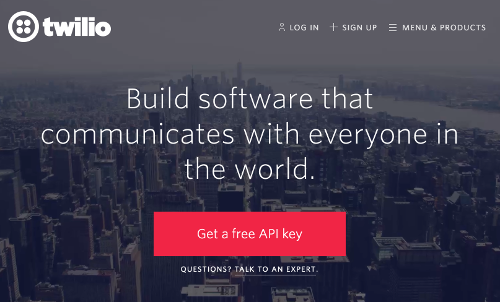
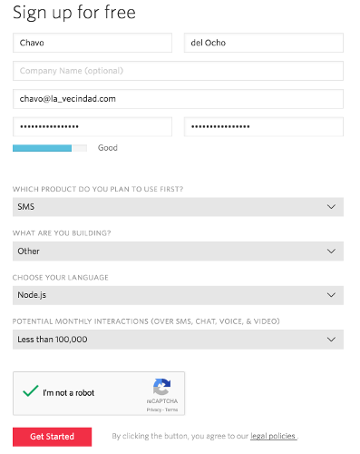
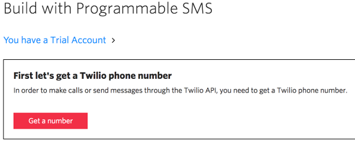
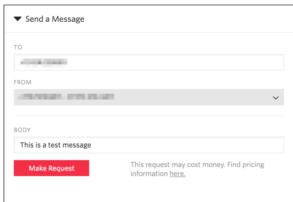

# Lab 4 - Connect to Twilio for text/sms capabilities
Next we want to connect our bot to Twillio so that we can receive SMS alerts from our bot!

## Create/Setup a Twillio Account
Creation of a Twillio account is necessary to enable the text/sms features of this project.  If you do not wish to use this functionality then you may skip this section.

1. Navigate your browser to http://twilio.com

2. On the main page, click the button that says `Get a free api key`

3. Fill in your personal details then click the `Get Started` button at the bottom of the page.

4. Next you'll need to authenticate with your personal mobile number, do this and make sure you can receive the text messages from Twilio on your own device.

5. Once you've authenticated yourself you'll need to pick a Twilio phone number.  Follow the steps to do this.

6. After your number has been created, make note of it (maybe even add it as a contact to your mobile device) and then click the area which says `Send a message` and follow the instrutions to send a text message to your mobile device from your Twilio number.  It doesnt need to be a fancy message, this is just at test.

7. There are 3 values we want to capture from your new Twilio account, plus your mobile device number:

* TWILIO_ACCOUNT_SID
* TWILIO_AUTH_TOKEN
* TWILIO_TO_NUMBER (your device number)
* TWILIO_FROM_NUMBER (your twilio number)

8. Twilio Account SID and Auth Token
These values are available on your [Twilio Account page](https://www.twilio.com/user/account/settings). Copy both the SID and token values.

9. If you are not running your bot at a public, SSL-enabled internet address, use localtunnel.me to make it available to Twilio. Note the URL it gives you. For example, it may say your url is https://xyx.localtunnel.me/ In this case, the webhook URL for use would be https://xyx.localtunnel.me/twilio/receive

10. Set up a webhook endpoint for your app that uses your public URL, or the URL that localtunnel gave you. This is done on [settings page](https://www.twilio.com/user/account/ip-messaging/services) for your IP Messaging service. Enable all of the POST-event webhooks events!

11. Profit :boom:

### Wow that was pretty awesome!  Let's go to [Lab 5](https://github.com/ov3rblik/cerebro/tree/master/Lab5)!
